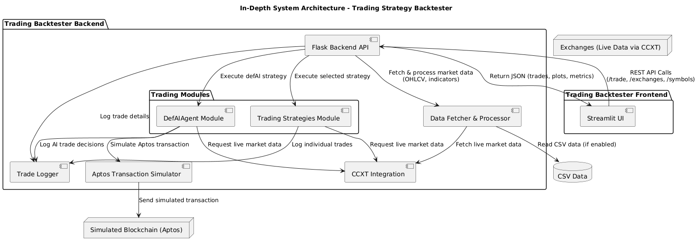

---

# 📈 Auto DeFi: Autonomous AI Agent for DeFi Trading with Aptos Integration

## 🚀 Project Overview

**Auto DeFi** (DefAIAgent) is an autonomous Artificial Intelligence agent tailored for Decentralized Finance (DeFi) trading. This innovative platform optimizes yield, manages risk dynamically, and automates portfolio rebalancing actions through seamless integration with the Aptos blockchain. It harnesses advanced Japanese-inspired crypto trading strategies, making it particularly suited for volatile cryptocurrency markets.

---

## 🌟 Key Features

- **Autonomous Trading:** Automated portfolio management and strategy execution.
- **Blockchain Integration**: Secure transactions on Aptos blockchain via the official Aptos SDK.
- **Advanced Algorithms**: Combines Yield Score, Risk Index, and dynamic allocation models.
- **Interactive Visualization**: Real-time insights and visual analytics using Plotly and Streamlit.

---

## 🛠 Project Architecture

Auto DeFi consists of several integrated modules:

- **Data Acquisition** (`CCXT`, CSV sources)
- **Metrics Computation**: Yield Score, Risk Index calculation.
- **Trading Strategies**: Japanese-inspired mathematical frameworks (KAGE, KITSUNE, RYU, SAKURA, HIKARI, TENSHI, ZEN).
- **Rebalancing Signals**: Automated triggers for portfolio adjustments.
- **Frontend Interface**: Streamlit application for easy user interaction.
- **Logging & Monitoring**: Detailed trade logs and interactive visualizations.

---
## System Design:
   1. Activity Diagram
   

   2. System Design:
   

   3. User Flow Diagram:
    

---
## 📂 Project Structure

```
Auto DeFi/
├── backend/
│   └── aptos_backend.py
├── frontend/
│   └── aptos_frontend.py
├── docs/
│   ├── Aptos AI Agent.pdf
│   ├── aptos trader.pdf
│   └── japanses-inspired-trading-strategy.pdf
├── design
│   ├── Activity Diagram.png
│   ├── system-design.png
│   └── user flow diagram.png
└── output
    └── trades.log
```

---

## 🧠 Algorithmic Strategies and Frameworks

### 📌 defAI Algorithm (Core Strategy)

The defAI strategy autonomously optimizes yields, manages risks, and triggers rebalancing transactions using:

- **Yield Score**:
  $$
  \text{Yield Score}(t) = \frac{\mu_r(t)}{\sigma_r(t) + \epsilon}
  $$
  where \( \mu_r(t) \) is the rolling mean return, and \( \sigma_r(t) \) is volatility.

- **Risk Index**:
  $$
  \text{Risk Index}(t) = \sigma_r(t) \times 100
  $$

- **Rebalancing Signal**:
  ```
  if |allocation - target| > 0.1, execute blockchain rebalance transaction.
  ```

---

## 🎌 Japanese-Inspired Trading Frameworks

### 1. **Kage no Suiri (Shadow Logic Strategy)**
- Uses GARCH volatility modeling and Hidden Markov Models (HMM) for market state detection.

### 2. **Kitsune no Kōsen (Fox’s Beam Framework)**
- Employs Dynamic Time Warping (DTW) and Neural Networks for price forecasting.

### 3. **Ryu no Riron (Dragon’s Theory Algorithm)**
- Applies fractal dimensions and Lyapunov exponent calculations to identify chaotic market conditions.

### 4. **Sakura no Kagami (Cherry Blossom Mirror Model)**
- Implements regression with mirror constraints for trend prediction and trading signals.

### 4. **Hikari no Suishin (Advance of Light Momentum)**
- Leverages Principal Component Analysis (PCA) for momentum-based trade signals.

### 5. **Tenshi no Shikaku (Angel’s Geometry Framework)**
- Uses topological data analysis (persistent homology) for identifying significant market features.

### 6. **Zen no Ritsu (Zen Rhythm Trading Model)**
- Incorporates wavelet analysis for trend and cycle detection, signaling trades based on market rhythms.

---

## 🌐 Frontend Interface (Streamlit)

**Interactive Web Dashboard**:
- User-friendly GUI for configuring strategies, exchanges, symbols, RSI/MA parameters, and backtesting.
- Real-time visualization of trade results and performance metrics.
- Easy downloading of historical trade logs and CSV data.

---

## ⚙️ Backend API (Flask-based)

The backend API provides endpoints for:
- **Market data acquisition** (using CCXT or local CSV files)
- **Execution of trading strategies** (RSI, MA, RSI_MA, advanced Japanese-inspired frameworks)
- **Blockchain Transactions** (via Aptos SDK integration)
- **Plot generation** (matplotlib and Plotly-based visuals for market analysis)

---

## 📊 How to Run

### 🛠️ Installation & Setup

```bash
git clone https://github.com/ivelinweb/Auto-Defi.git
cd Auto-Defi
pip install -r requirements.txt
```

Ensure the backend Flask server is running:
```bash
python backend/aptos_backend.py
```

Start the frontend Streamlit application:
```bash
streamlit run frontend/aptos_frontend.py
```

---

## 🖥️ Usage Instructions

- Launch the frontend UI at: [http://localhost:8501](http://localhost:8501)
- Configure parameters in the sidebar.
- Execute backtesting by clicking "Run Backtest".

---

## 📊 Visualization & Metrics

- **Interactive Plotly charts** displaying:
  - Yield Scores
  - Risk Indices
  - Trade entry and exit points.

- **Performance Metrics**:
  - Total Trades
  - Win Rate (%)
  - Total Return (%)
  - Average Return per Trade (%)

---

## 🔗 Aptos Blockchain Integration

The system leverages the Aptos SDK to securely execute on-chain transactions:
- Portfolio rebalancing
- Yield harvesting
- Secure and transparent execution of automated trading strategies.

---

## 📝 Documentation & Theory

Detailed technical and theoretical documentation are provided:

- [Aptos AI Agent](docs/Aptos%20AI%20Agent.pdf)
- [Aptos Trader Implementation](docs/aptos%20trader.pdf)
- [Japanese-Inspired Crypto Strategies](docs/japanses-inspired-trading-strategy.pdf)

---

## 🤝 Contributing

We welcome contributions! Fork this repository, create your feature branch, and submit a pull request.

---

## 📄 License

Distributed under the MIT License.

---

## ✨ Conclusion

Auto DeFi is a comprehensive, sophisticated DeFi solution integrating mathematical rigor with practical blockchain execution. It is designed for researchers, crypto enthusiasts, and professional traders seeking automated, AI-driven trading solutions.

---

📌 **Note:** Ensure the backend Flask service and Aptos blockchain access are correctly configured for optimal performance.

---
